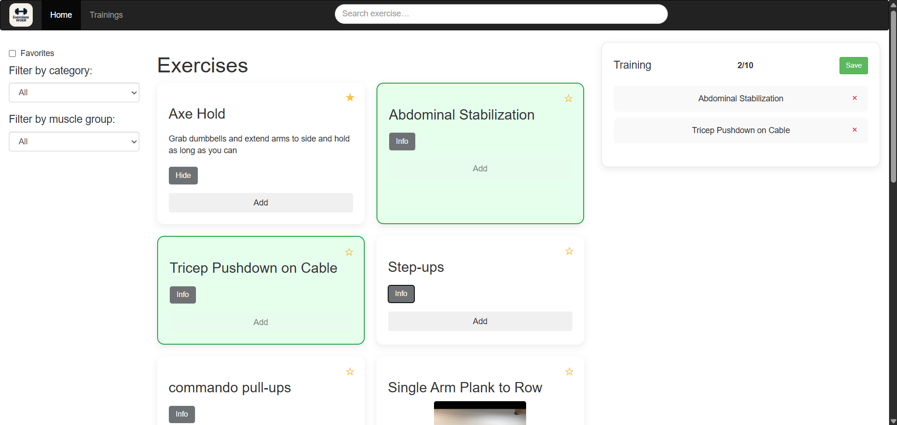

# Projeto: Consumindo uma API pública

Acesso: (https://elc1090.github.io/project2-2025a-bruno-joaomarcos/)

### Desenvolvedores
Bruno Perussatto — Ciência da Computação  
João Marcos Wilhelms Frigo - Sistemas de Informação

### Nosso produto

Este é um web app que consome a API pública do WGER para listar, filtrar e detalhar exercícios físicos. As principais funcionalidades são:
- Listagem paginada de exercícios com nome, imagem e descrição.
- Filtros por categoria, grupo muscular e “somente favoritos”.
- Busca em tempo real por nome de exercício no header.
- Marcação de exercícios como favoritos (persistência em LocalStorage).
- Construção de “grupos de treino” adicionando exercícios selecionados em painel lateral.
- Salvamento, edição e exclusão de grupos de treino personalizados no LocalStorage.  
Durante o desenvolvimento do projeto, conseguimos aprender como consumir dados de uma API pública, interpretar e integrar essas informações na aplicação de forma dinâmica. Além disso, exploramos o uso do LocalStorage para armazenar dados de forma persistente no navegador.

### Desenvolvimento

- Levantamento de requisitos: mapeamento dos endpoints WGER (categories, muscles, exerciseinfo) e definição das views “Exercises” e “Trainings”.
- Implementação da interface: estrutura em HTML5 com Bootstrap 3, grade responsiva de cards e navbar com campo de busca centralizado.
- Integração com API: uso de fetch() para obter JSON, aplicação de filtros (categoria, músculo, favoritos), busca por termo em tempo real e paginação via slice().
- Estado e persistência: controle de exercícios selecionados com Map e arrays, armazenamento de favoritos e grupos em LocalStorage e contador visual com limite de 10 itens.
- Polimento e testes: ajustes finais de CSS (bordas, sombras e responsividade), debug em console e validação no Chrome e Firefox.

#### Tecnologias

- HTML5

- CSS3 

- JavaScript

- LocalStorage API

#### Ambiente de desenvolvimento

- VSCode

- Live Server

- Git + GitHub

- GitHub Copilot

#### Referências e créditos

- WGER API: Documentação oficial da API de exercícios — https://wger.de/api-docs
- Bootstrap (W3Schools): https://www.w3schools.com/bootstrap/tryit.asp?filename=trybs_temp_webpage&stacked=h
- ChatGPT: Auxílio na geração de trechos de código em JavaScript e CSS.  
Prompt exemplo 1: "Como adicionar uma barra de pesquisa no header para filtrar exercícios por nome, respeitando filtros de categoria, músculo e favoritos."  
Prompt exemplo 2: "Ajude a estilizar o card de exercício no styles.css para ter bordas arredondadas, sombra sutil e layout em grid responsivo."

---
Projeto entregue para a disciplina de [Desenvolvimento de Software para a Web](http://github.com/andreainfufsm/elc1090-2025a) em 2025a
